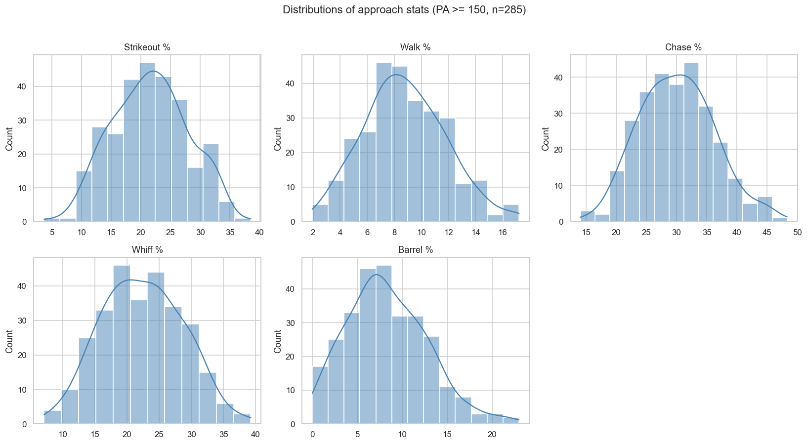
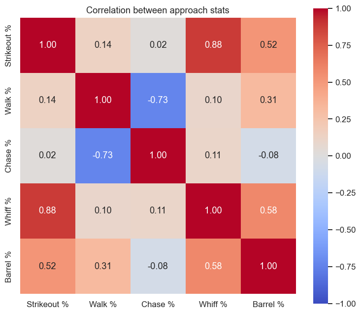
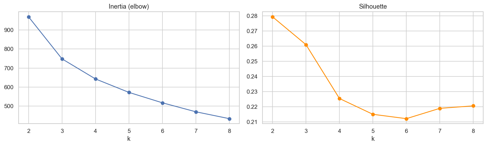
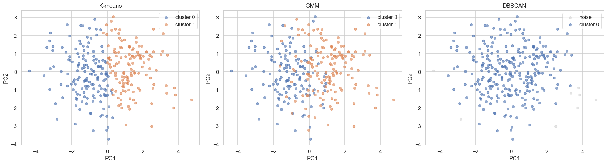
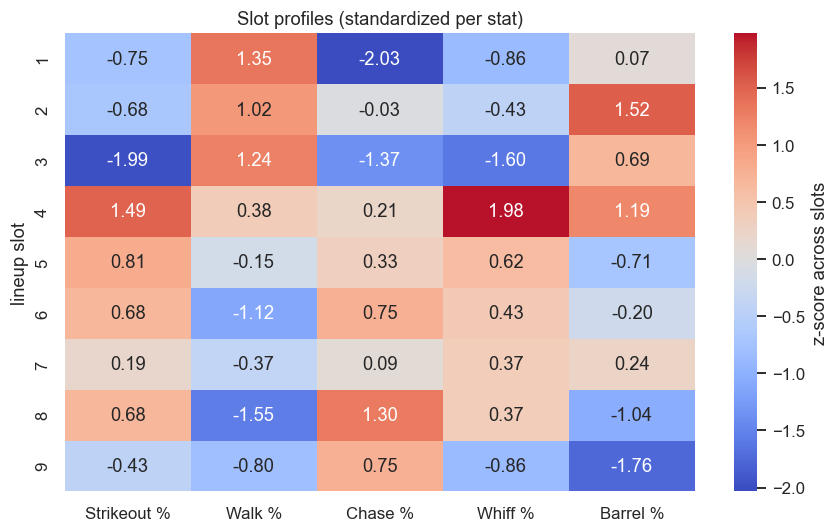
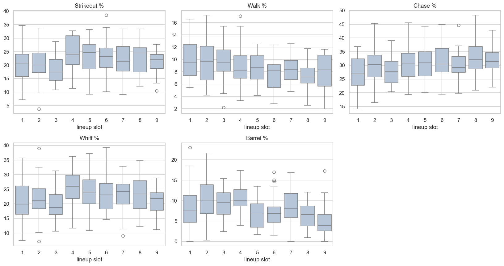
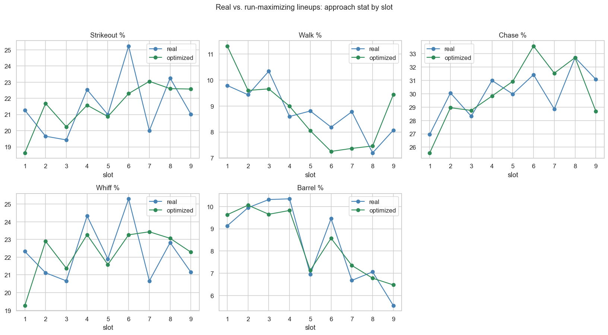
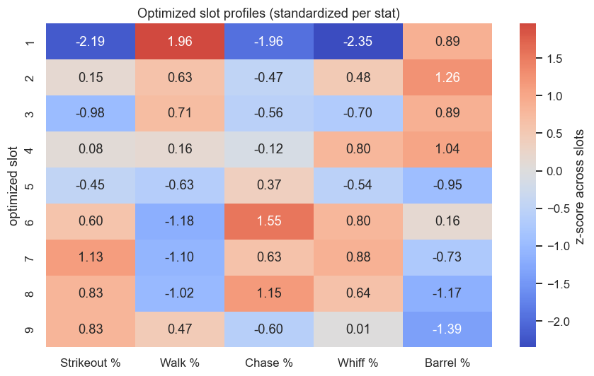

# ⚾ Lineup Lab — do power hitters belong higher in the order?

**Hypothesis.** Power hitters may score more runs batting *higher* in the order — where a walk or
an extra-base hit is more valuable — rather than in the traditional 3-4-5 spots, with contact
hitters behind them to move runners over.

To test it on **2026** data (season in progress, pulled through ~2026-06-30) the project runs a
four-stage pipeline: profile every hitter's plate approach from Statcast, check whether hitters
fall into discrete "power vs. contact" archetypes, reconstruct each team's real batting order, then
run a Monte Carlo base-out simulator to search each team's 9! order space for the run-maximizing
lineup — and finally compare where power ends up in the real vs. optimized orders.

> **TL;DR of the result:** batting order moves the needle only ~0.05 R/G on average (significant for
> 7 of 30 teams), but the *direction* the optimizer pushes is consistent with the hypothesis — it
> pulls on-base skill and power up and pushes free-swinging, low-walk bats down. The visualizations
> below tell that story; each has space for your own read.

---

## Pipeline at a glance

| Stage | Script / notebook | Output |
|------|-------------------|--------|
| 1. Approach stats | `pull_hitter_data.py` → `explore_hitters.ipynb` | K%, BB%, chase%, whiff%, barrel% per hitter |
| 2. Archetypes? | `cluster_hitters.ipynb` | K-means / GMM / DBSCAN — do clusters exist? |
| 3. Real lineups | `pull_lineup_data.py` → `explore_lineups.ipynb` | approach stat by real batting slot |
| 4. Optimize & test | `lineup_sim.py` → `optimize_lineups.py` → `analyze_optimal_lineups.ipynb` | run-maximizing order per team, real vs. optimized |
| 5. Explore | `dashboard.py` | interactive Streamlit dashboard |

Full method notes are in [`CLAUDE.md`](CLAUDE.md) and [`instructions.md`](instructions.md).

---

## 1. What does plate approach look like? (`explore_hitters.ipynb`)

Five approach stats for the 285 hitters with PA ≥ 150.



*Distributions of each approach stat. Most are roughly bell-shaped; barrel% is right-skewed (a long
tail of elite power).*

> **Your take:** _…_



*Correlations between the five stats. Two things pop: strikeout% ↔ whiff% are almost the same axis
(r = 0.88), and walk% ↔ chase% are strongly negative (r = −0.73) — a plate-discipline axis that is
largely independent of the power/whiff axis.*

> **Your take:** _…_

---

## 2. Are there real "power" vs. "contact" archetypes? (`cluster_hitters.ipynb`)

Short answer: **no discrete classes** — the stats form a continuum. All three algorithms agree.



*K-means: no elbow, and the best silhouette is a weak **0.28 at k = 2**. GMM's BIC is minimized at a
**single** Gaussian; DBSCAN finds one dense blob plus a few outliers at every eps.*

> **Your take:** _…_



*The same 285 hitters on the first two principal components (PC1 + PC2 ≈ 83% of variance). There is
one continuous cloud, not separated islands — any "cluster" line just cuts the blob along the power
axis. **Implication:** treat "power" as a position on a spectrum (e.g. barrel/whiff), not a hard
label.*

> **Your take:** _…_

---

## 3. How are real 2026 lineups actually built? (`explore_lineups.ipynb`)

Each qualified hitter's modal batting slot vs. their approach stats — the baseline the optimizer has
to beat.



*Slot profiles, standardized per stat (z-score across the nine slots). Barrel% and walk% peak in
slots 2-4 and fade toward the bottom; chase% and K% climb toward the bottom of the order — the
conventional shape.*

> **Your take:** _…_



*But the spread within each slot is huge. The slot means differ (barrel% explains the most, η² ≈
0.15, Spearman r ≈ −0.28 vs. slot), yet the 9-slot silhouette is ≈ −0.1: slots overlap almost
completely. Real orders sort by power only weakly.*

> **Your take:** _…_

---

## 4. Where does the simulator put power? (`analyze_optimal_lineups.ipynb`)

The Monte Carlo simulator (`lineup_sim.py`, calibrated to ~4.4 R/G league average) hill-climbs each
team's order for maximum runs. The real order is always a candidate, so the optimized order can
never score below it.



*The key figure: mean approach stat by slot, real (blue) vs. run-maximizing (green). The optimizer
**steepens the top-of-order concentration of on-base skill and power** — walk% rises in slots 1-3
and drops harder at the bottom; chase% and K% get pushed down. Spearman r vs. slot: walk% −0.22 →
−0.29, chase% +0.17 → +0.23. The top-30 barrel hitters' mean slot moves up from 3.70 → 3.43.*

> **Your take:** _…_



*The optimized slot profile, standardized. Compared with the real heatmap in §3, the discipline
signal (walk% up top, chase%/K% down low) is sharper — η² for walk% roughly doubles (0.09 → 0.19).
Order effects are small in runs, but the optimizer's preferred *shape* is consistent.*

> **Your take:** _…_

---

## 5. Explore it yourself — the dashboard (`dashboard.py`)

A dark, Baseball-Savant-styled Streamlit app: pick a team, see its real lineup next to the
run-maximizing order as lineup cards, with a stat switcher (OBP / Barrel% / BB% / K%) heat-shaded by
percentile vs. the league, and the runs/game gain **gated on statistical significance** (`p < 0.05`).

```bash
pip install -r requirements.txt
streamlit run dashboard.py
```

---

## Caveats (read before over-interpreting)

- **Each plate appearance is drawn independently** — no count, pitcher, park, or lineup-protection
  effects. Batting order matters here *only through sequencing* (who bats with runners on), which is
  exactly the effect being tested.
- **Raw individual rates**, no regression to the mean — rare events (3B, SB) are noisy for low-PA
  hitters.
- **Order effects are small** (~0.1–0.3 R/G between a good and a poor order) and the hill-climb is a
  heuristic (local optimum, not a proven global best). Deltas are **directional, not exact**.
- Two teams have < 9 qualified hitters; their 9th slot is padded with a league-average batter.

## Reproducing the figures

The images in this README are regenerated from the notebooks (matplotlib `Agg` backend). Run the
notebooks in VS Code (Run All), or re-run the pipeline scripts in the order in the table above.
